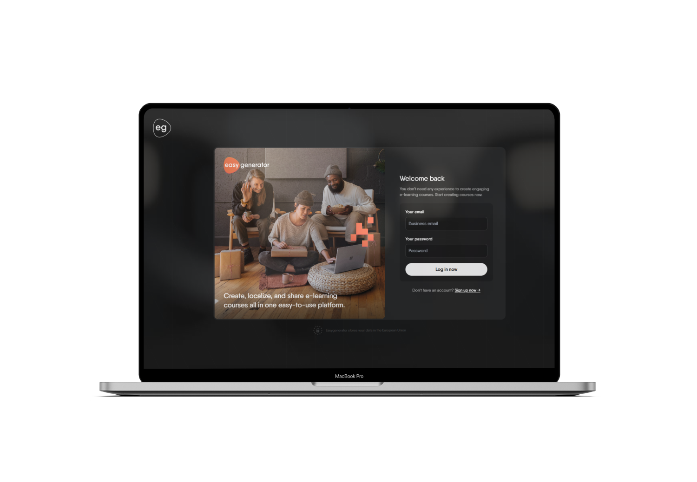

# Easy Generator Full Stack Dev.
Here you can see a [demo for this application on Youtube](https://youtu.be/JYKfqBM2omI?si=1k0M8CVYJF2b1Yse).

Full Stack Test Task - Implement a module that would allow a user to sign up and sign in, to the application

## Starting project
Client: cd client & npm run dev
Server: cd server & npm run start:dev

If you build both projects, you will have to change the server port in the origin (server/src/main.ts) to make the API (cors) work.

## Resume
I have integrated a signup and login, using security features such as frontend and backend verification of data input, limiting spam to the API, cookies via HTTP Only to avoid XSS attacks.

## Frontend
On the frontend I chose a modern and user friendly design, as a simulation of an Easy Generator application. It is made with React, TS and TailwindCSS to ease the work on the design side. There are form validations, messages for each input, errors with messages, animations and loaders, the user will know what to do. Responsive version is also completed.

## Backend
• On the backend side, I used as requested, Nest.js and MongoDB (Atlas for easy direct input by the tester). \
• Validations have also been introduced on the backend to prevent incorrectly entered data in the database. \
• Also, JWT was used as a security method. It is sent as a cookie in the login or registration request and set automatically in the browser. \
• In the future, for other API Requests, cookie-parser is used to get that token containing the user id from Mongo of that user. Logout route deletes the cookie.

